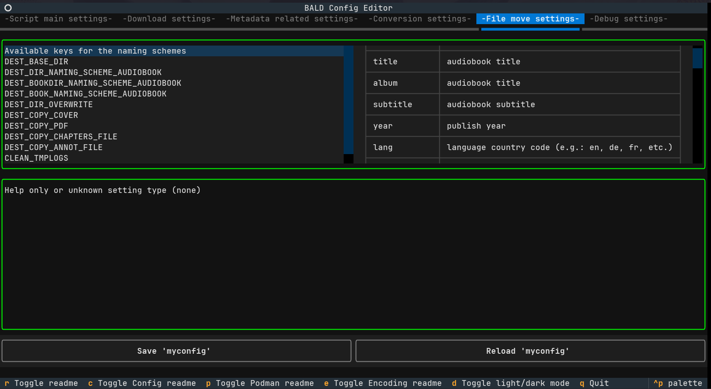

[](https://quay.io/repository/damajor/bald)
[](https://deepwiki.com/damajor/BALD)


    BBBBBBBBBBBBBBBBB               AAA               LLLLLLLLLLL             DDDDDDDDDDDDD        
    B::::::::::::::::B             A:::A              L:::::::::L             D::::::::::::DDD     
    B::::::BBBBBB:::::B           A:::::A             L:::::::::L             D:::::::::::::::DD   
    BB:::::B     B:::::B         A:::::::A            LL:::::::LL             DDD:::::DDDDD:::::D  
      B::::B     B:::::B        A:::::::::A             L:::::L                 D:::::D    D:::::D 
      B::::B     B:::::B       A:::::A:::::A            L:::::L                 D:::::D     D:::::D
      B::::BBBBBB:::::B       A:::::A A:::::A           L:::::L                 D:::::D     D:::::D
      B:::::::::::::BB       A:::::A   A:::::A          L:::::L                 D:::::D     D:::::D
      B::::BBBBBB:::::B     A:::::A     A:::::A         L:::::L                 D:::::D     D:::::D
      B::::B     B:::::B   A:::::AAAAAAAAA:::::A        L:::::L                 D:::::D     D:::::D
      B::::B     B:::::B  A:::::::::::::::::::::A       L:::::L                 D:::::D     D:::::D
      B::::B     B:::::B A:::::AAAAAAAAAAAAA:::::A      L:::::L         LLLLLL  D:::::D    D:::::D 
    BB:::::BBBBBB::::::BA:::::A             A:::::A   LL:::::::LLLLLLLLL:::::LDDD:::::DDDDD:::::D  
    B:::::::::::::::::BA:::::A               A:::::A  L::::::::::::::::::::::LD:::::::::::::::DD   
    B::::::::::::::::BA:::::A                 A:::::A L::::::::::::::::::::::LD::::::::::::DDD     
    BBBBBBBBBBBBBBBBBAAAAAAA                   AAAAAAALLLLLLLLLLLLLLLLLLLLLLLLDDDDDDDDDDDDD        
                _____               _                     _____       _ _ _   _          
               | __  |___ ___ ___ _| |   ___ ___ _ _ _   |  _  |_ _ _| |_| |_| |___      
               | __ -|  _| .'|   | . |  |   | -_| | | |  |     | | | . | | . | | -_|     
               |_____|_| |__,|_|_|___|  |_|_|___|_____|  |__|__|___|___|_|___|_|___|     
                                                                                         
             __    _ _                      ____                _           _         
            |  |  |_| |_ ___ ___ ___ _ _   |    \ ___ _ _ _ ___| |___ ___ _| |___ ___ 
            |  |__| | . |  _| .'|  _| | |  |  |  | . | | | |   | | . | .'| . | -_|  _|
            |_____|_|___|_| |__,|_| |_  |  |____/|___|_____|_|_|_|___|__,|___|___|_|  
                                    |___|                                             


Brand new Audible Library Downloader
====================================

**Author: damajor**

**Source code: [BALD @ GitHub](https://github.com/damajor/BALD)**

**Topics: Automatic download / art cover embedding / metadata tagging / conversion / renaming of Audible books**

Table of content
================
<!-- @import "[TOC]" {cmd="toc" depthFrom=1 depthTo=4 orderedList=true} -->
<!-- code_chunk_output -->

1. [Description](#description)
2. [Feature details](#feature-details)
3. [For the impatient](#for-the-impatient)
4. [Pre-requisites](#pre-requisites)
5. [Required tools](#required-tools)
6. [Optional tools](#optional-tools)
7. [Repository files description](#repository-files-description)
8. [Installation](#installation)
9. [Usage examples](#usage-examples)
    1. [Manual run](#manual-run)
    2. [Automatic run (crontab)](#automatic-run-crontab)
    3. [Container usage](#container-usage)
        1. [Container volume maps list](#container-volume-maps-list)
            1. [Required](#required)
            2. [Optional](#optional)
        2. [Audible CLI initialization](#audible-cli-initialization)
        3. [Podman command line](#podman-command-line)
        4. [Podman compose](#podman-compose)
        5. [Podman Quadlet (systemd integration)](#podman-quadlet-systemd-integration)
        6. [Podman Quadlet Automation](#podman-quadlet-automation)
10. [Configuration](#configuration)
11. [Config Editor](#config-editor)
    1. [Preview](#preview)
    2. [Usage after cloning repository](#usage-after-cloning-repository)
    3. [Usage from inside container](#usage-from-inside-container)
12. [Anti-piracy notice](#anti-piracy-notice)
13. [License](#license)

<!-- /code_chunk_output -->

# Description

BALD is a highly configurable tool to download your Audible library and build your local library.  
BALD uses various tools to download, enrich metadata, convert audiobooks, rename files and move them to target location.
This script is intended to be run on a Linux system (WSL may work) with bash and some other tools installed

Last run time is stored in a status file for next runs, so only deltas are downloaded.

Some logs will be created & deleted inside `script_dir/tmp` directory.
All working files during processing are stored in the same directory as the downloaded books.

A Dockerfile is also provided for those who want to use it in rootless containers.

In case of a problem please open an issue on GitHub <https://github.com/damajor/BALD/issues>

> **NB:**
> Some metadata may be wrong or malformed, don't blame the script but complains to Audible
> If you find a reliable logic or source of metadata to fix Audible quirks, open an issue & let me know.

> **Notes regarding MP4:**
> While MP4 conversion is supported, OGA is recommended.
> Thumbnails on MP4 may not always work.
> Moreover, for high quality MP4/AAC encoding, FFmpeg requires to be compiled with non-free codecs. OGG Vorbis gives better results, better compression, better compression quality out of the box and good compatibility ;)

# Feature details

 - automatic Audible audiobooks downloads
 - crontab friendly (delta runs)
 - library history downloads (full & deltas)
 - wishlist download
 - either one of:
   - keep original chapters,
   - chapters renaming,
   - or rebuild entirely all chapters
 - metadata enrichment (from normal & hidden AAX/AAXC tags, or from history TSV file)
 - cover art embedding
 - audiobooks conversion to **oga** (Ogg container with Opus codec)
 - audiobooks conversion to **m4b** (MP4 container with AAC codec)
 - size control of converted audiobooks:
   - custom fixed bitrate
   - dynamic bitrate based on a user ratio
 - parallelization of heavy work (conversion & metadata enrichment)
 - "perfect" embedded metadata for AudioBookShelf ([AudioBookShelf](https://github.com/advplyr/audiobookshelf))
 - dynamic naming scheme for destination directories & file names
 - helper script for downloading external scripts
 - container Dockerfile provided with all dependencies & external scripts (tested on Podman rootless)
 - basic statistics after each run
 - local TSV database of converted audiobooks
 - now with a quick & dirty TUI config editor
 - and more...

# For the impatient

- Go read the full Podman walkthrough here [README_Podman_Walkthrough.md](README_Podman_Walkthrough.md).
- Read the full parameter settings here [README_Config_Parameters.md](README_Config_Parameters.md).
- Encoding parameters examples [README_Encoding_Options.md](README_Encoding_Options.md)

# Pre-requisites

 - install `audible-cli` and create a profile (check instructions here <https://github.com/mkb79/audible-cli>)
 - modify script user config variables to match your needs
 - run `parallel --citation` and follow instructions to avoid output warning garbage

# Required tools

 - bash (v4.3+)
 - jq
 - bc
 - xxd (for ogg image blobber script)
 - audible-cli (at least version 0.3.2b3)
 - ffmpeg / ffprobe (tested 6.1.2 & 7.1)
 - mediainfo
 - parallel
 - AtomicParsley (for MP4 artwork/cover)

**Also download these scripts and put them in the same directory as this script**

 - `ogg-image-blobber.sh` (from <https://github.com/twopoint71/ogg-image-blobber>)
 - `update_chapter_titles.py` (from <https://github.com/mkb79/audible-cli/blob/master/utils/update_chapter_titles.py>)

# Optional tools

 - Java + Tika (download jar from [Apache Tika](https://tika.apache.org/))  
   **It slows down metadata extraction** but gives very good language accuracy detection.

Or

 - Your own Tika server (**processing is faster than using the jar**)

# Repository files description

- `BALD.sh` it is the main script with all the processing logic.
- `grab_additional_scripts.sh` a quick and dirty script for lazy boys. It will download external scripts and optional tool for you, as well creating a user config file with default values (just remove `myconfig` if you want to set parameters in the script itself).
- `docker_mod.sh` not to be used directly by the user, it is sourced by the main script to make it compatible with containers.
- `rebuild_chapters.sh` used to build `ffmpeg` chapters metadata
- `Dockerfile` used to build your own container image.
- `compose.yaml` example of for Podman/Docker compose.
- `README.md` the file you are currently reading.
- `README.pdf` for convenience purposes the README is also exported as PDF file.
- `LICENSE` is the license file of this project.

# Installation

It is as simple as:

1. Clone GitHub repository or download archive of it  
`git clone https://github.com/damajor/BALD`  
2. Manually grab external tools and put them in the same directory of the script **OR** execute the download script (this will also create a default `myconfig` file)  
`./grab_additional_scripts.sh`  
3. Carefully configure all settings in `myconfig` or directly inside the script

> **Note:**  
> The script is not compatible with NTFS filesystem.

# Usage examples

Double check prerequisites and settings :)

BALD was designed to run every day at most.

## Manual run

Once configured the only thing is to run the script.

On the first run the script will download ALL your library to the desired location and will do its jobs for metadata, conversion and moving converted files to target location.

Upcoming runs will only download new books from Audible (delta run) and process them as usual.

> **Example:**  
> either  
> `/full/path/of/script/BALD.sh`  
> or if the script is in your path, just use:  
> `BALD.sh`  
> or if you start it manually from the script location:  
> `./BALD.sh`

## Automatic run (crontab)

It is recommended to run the script daily at most. It works better with a daily scheduling or more like every week or month.

> **Example:**  
> Run every day at 4PM  
> `0 4 * * * /full/path/of/script/BALD.sh >dev/null 2>/dev/null`  
> Run every first day of each month at 4PM  
> `0 4 1 * * /full/path/of/script/BALD.sh >dev/null 2>/dev/null`

> **Notes:**  
> - Please note that automated runs does NOT prevent you to manually run the script at any time you want.  
> Example, if you set up a weekly update, but you want to quickly run it manually once because you purchased a new audiobook, then just do it! (the script will store the last execution to the time of the manual run)  
> - Before setting up your automation, try to run manually the script to see if it behaves the way you have configured it.  
> - **Also, it is HIGHLY recommended doing the first run manually. Just because it will sync entire library and can take hours of processing for big libraries.**

## Container usage

[](https://quay.io/repository/damajor/bald)

> **Notes:**  
> The script has been developed using Podman rootless.  
> It should work on Docker (rootless or not).  
> Everything inside the container runs as 'root' user, **use rootless containers without CAP_ADMIN for security**.

> **IMPORTANT:**  
> [Initialize audible-cli](#audible-cli-initialization)

When used in containers the script makes some settings 'readonly'.
The user MUST map specific volumes (the script will check all volumes are mapped, or it will exit).

The following settings are hard coded using the script inside container:
```
HIST_LIB_DIR="/audible_history"
STATUS_FILE="/status_file"
DOWNLOAD_DIR="/audible_dl"
DEST_BASE_DIR="/audiobooks_dest"
LOCAL_DB="/BALD/personal_library.tsv"
DEBUG_USEAAXSAMPLE=/sample.aax
DEBUG_USEAAXCSAMPLE=/sample.aaxc
```
The user is responsible to map volumes accordingly.

### Container volume maps list

When mapping local directories to your container, make sure that they all exist.

#### Required

The following volumes MUST be mapped to the container, if one map is missing the script will exit with an error message with the missing volume:

| Local                                     | Container                   | Type    |
|-------------------------------------------|-----------------------------|---------|
| [HIST_LIB_DIR](README_Config_Parameters.md#hist_lib_dir)             | /audible_history            | dir     |
| [STATUS_FILE](README_Config_Parameters.md#status_file)               | /status_file                | file    |
| [DOWNLOAD_DIR](README_Config_Parameters.md#download_dir)             | /audible_dl                 | dir     |
| [DEST_BASE_DIR](README_Config_Parameters.md#dest_base_dir)           | /audiobooks_dest            | dir     |
| [LOCAL_DB](README_Config_Parameters.md#local_db)                     | /BALD/personal_library.tsv  | dir     |
| myconfig                                  | /BALD/myconfig              | file    |
| tmp logs directory                        | /BALD/tmp                   | dir     |
| audible-cli config dir                    | /root/.audible              | dir     |

#### Optional

Those volumes are optional, just if you want to debug the script:

| Local                                         | Container             | Type    |
|-----------------------------------------------|-----------------------|---------|
| [DEBUG_USEAAXSAMPLE](README_Config_Parameters.md#debug_useaaxsample)     | /BALD/sample.aax      | file    |
| [DEBUG_USEAAXCSAMPLE](README_Config_Parameters.md#debug_useaaxcsample)   | /BALD/sample.aaxc     | file    |
| aaxc voucher file                             | /BALD/sample.voucher  | file    |

### Audible CLI initialization

If you have `audible-cli` installed and initialized then you can directly map your `audible-cli` config directory and skip this part.

If you had never used `audible-cli` then follow what comes next.

Make local `audible-cli` configuration directory:  
    `mkdir -p /home/myuser/.audible`

Run `audible-cli` quick-start enrollment:  
    `podman run -it --rm -v /home/myuser/.audible:/root/.audible quay.io/damajor/bald:latest audible quickstart`

For more information refers to `audible-cli` documentation here <https://github.com/mkb79/audible-cli/blob/master/README.md#getting-started>.

### Podman command line

If you want to use the following settings with Podman:
```
HIST_LIB_DIR="/home/myuser/Audible/lib_history"
STATUS_FILE="/home/myuser/Audible/audible_last_sync"
DOWNLOAD_DIR="/home/myuser/Audible/Downloads"
DEST_BASE_DIR="/home/myuser/AudioBookShelf/audiobooks"
LOCAL_DB="/home/myuser/Audible/personal_library.tsv"
DEBUG_USEAAXSAMPLE=sample.aax
DEBUG_USEAAXCSAMPLE=sample.aaxc
```

Use the following command (*change local paths to match your needs*):
```
podman run -it --rm \
    -v /home/myuser/.audible:/root/.audible \
    -v /home/myuser/Audible/lib_history:/audible_history \
    -v /home/myuser/Audible/audible_last_sync:/status_file \
    -v /home/myuser/Audible/Downloads:/audible_dl \
    -v /home/myuser/Audible/personal_library.tsv:/BALD/personal_library.tsv \
    -v /home/myuser/AudioBookShelf/audiobooks:/audiobooks_dest \
    -v /home/myuser/BALD/myconfig:/BALD/myconfig \
    -v /home/myuser/BALD/tmp:/BALD/tmp \
    quay.io/damajor/bald:latest
```

If you want to debug using sample files, just add:
```
    -v /home/myuser/BALD/sample.aax:/BALD/sample.aax \
    -v /home/myuser/BALD/sample.aaxc:/BALD/sample.aaxc \
    -v /home/myuser/BALD/sample.voucher:/BALD/sample.voucher \
```

### Podman compose

Use compose file only after you have done `audible-cli` initialization ([Help here](#audible-cli-initialization)).
Compose file example:

```
services:
  BALD:
    image: quay.io/damajor/bald:latest
    environment:
      - TZ=Europe/Rome
    volumes:
      - /home/myuser/.audible:/root/.audible:z
      - /home/myuser/Audible/lib_history:/audible_history:z
      - /home/myuser/Audible/audible_last_sync:/status_file:z
      - /home/myuser/Audible/downloads:/audible_dl:z
      - /home/myuser/Audible/personal_library.tsv:/BALD/personal_library.tsv:z
      - /home/myuser/AudioBookShelf/audiobooks:/audiobooks_dest:z
      - /home/myuser/BALD/myconfig:/BALD/myconfig:z
      - /home/myuser/BALD/tmp:/BALD/tmp:z
```

Run with:  
`podman compose -f compose.yaml up --force-recreate`

### Podman Quadlet (systemd integration)

Below is an example systemd quadlet for an oneshot BALD service.

1. Create a file `/home/YOURUSER/.config/containers/systemd/bald.container` with the content below (change the path to your local paths)

```
[Unit]
Description=Podman BALD

[Install]

[Service]
Restart=no
Type=oneshot

[Container]
Image=quay.io/damajor/bald:latest
ContainerName=bald
HostName=bald
AutoUpdate=registry
LogDriver=passthrough
Volume=/home/myuser/Audible/lib_history:/audible_history:Z
Volume=/home/myuser/Audible/audible_last_sync:/status_file:Z
Volume=/home/myuser/Audible/downloads:/audible_dl:Z
Volume=/home/myuser/AudioBookShelf/audiobooks:/audiobooks_dest:z
Volume=/home/myuser/Audible/personal_library.tsv:/BALD/personal_library.tsv:Z
Volume=/home/myuser/BALD/myconfig:/BALD/myconfig:Z
Volume=/home/myuser/BALD/tmp:/BALD/tmp:Z
Volume=/home/myuser/.audible:/root/.audible:Z
Environment="GENERIC_TIMEZONE=Europe/Rome" "TZ=Europe/Rome"
```

2. Run `systemctl --user daemon-reload`
3. To run BALD just do `systemctl --user start bald.service` each time you need to sync your Audible library

### Podman Quadlet Automation

For scheduling synchronization of your library, create a systemd timer.

1. Create the timer file `/home/YOURUSER/.config/systemd/user/bald.timer` with the following content

```
[Unit]
Description=Podman BALD timer
RefuseManualStart=no
RefuseManualStop=no

[Timer]
# Runs sync every day at 23:30
OnCalendar=Mon..Sun 23:30
Persistent=false
Unit=bald.service

[Install]
WantedBy=timers.target
```

2. Run `systemctl --user daemon-reload`
3. Enable & start the timer with `systemctl --user enable --now bald.timer`

# Configuration

**Make sure you read all setting descriptions and usage.**

Change the variables in the script section **User config** according to your needs.

**All the parameters MUST have a value set** (there is only basic validation).

You can avoid to change settings in the script itself by creating a file named `myconfig` and put all the settings in it. The script will load this file if it exists, otherwise it will use default values from script itself.
`myconfig` file takes precedence over internal settings.

**Read the full parameter settings here [README_Config_Parameters.md](README_Config_Parameters.md).**

# Config Editor

To change the `myconfig` settings you can also use the provided TUI configuration editor.

## Preview

[](medias/BALD_Config_Editor_preview.mp4)

## Usage after cloning repository

Run the following commands inside the cloned directory.

Install requirements:
`pip install -r requirements.txt`

Run the editor:
`python BALD_Config_Editor.py`

## Usage from inside container

```
podman run -it --rm \
    -e TERM=xterm-256color \
    -e COLORTERM=truecolor \
    -v /home/myuser/BALD/myconfig:/BALD/myconfig \
    quay.io/damajor/bald:latest python /BALD/BALD_Config_Editor.py
```

# Anti-piracy notice

**Note that this project does NOT ‘crack’ the DRM**. It simply allows the user to use their own encryption key (fetched from Audible servers) to decrypt the audiobook in the same manner that the official audiobook playing software does.

**Please only use this application for gaining full access to your own audiobooks for archiving/conversion/convenience. DeDRMed audiobooks should not be uploaded to open servers, torrents, or other methods of mass distribution. No help will be given to people doing such things. Authors, retailers, and publishers all need to make a living, so that they can continue to produce audiobooks for us to hear, and enjoy.**

This blurb is borrowed from the <https://apprenticealf.wordpress.com/> page.

# License

MIT License

Copyright (c) [2025] [damajor @ <https://github.com/damajor>]

Permission is hereby granted, free of charge, to any person obtaining a copy
of this software and associated documentation files (the "Software"), to deal
in the Software without restriction, including without limitation the rights
to use, copy, modify, merge, publish, distribute, sublicense, and/or sell
copies of the Software, and to permit persons to whom the Software is
furnished to do so, subject to the following conditions:

The above copyright notice and this permission notice shall be included in all
copies or substantial portions of the Software.

THE SOFTWARE IS PROVIDED "AS IS", WITHOUT WARRANTY OF ANY KIND, EXPRESS OR
IMPLIED, INCLUDING BUT NOT LIMITED TO THE WARRANTIES OF MERCHANTABILITY,
FITNESS FOR A PARTICULAR PURPOSE AND NONINFRINGEMENT. IN NO EVENT SHALL THE
AUTHORS OR COPYRIGHT HOLDERS BE LIABLE FOR ANY CLAIM, DAMAGES OR OTHER
LIABILITY, WHETHER IN AN ACTION OF CONTRACT, TORT OR OTHERWISE, ARISING FROM,
OUT OF OR IN CONNECTION WITH THE SOFTWARE OR THE USE OR OTHER DEALINGS IN THE
SOFTWARE.
